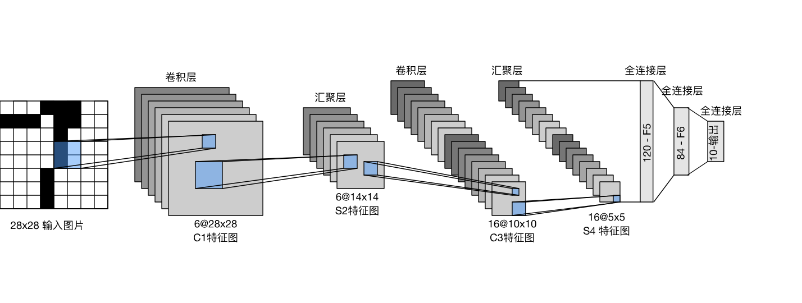
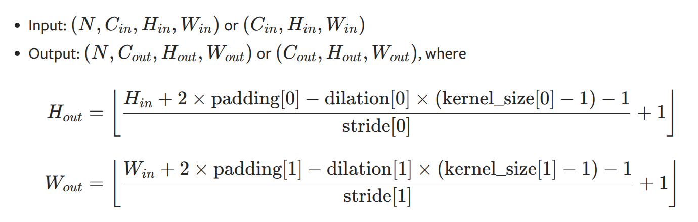

# 不同的手写数字识别

1998年，Yan LeCun 等人发表了论文《Gradient-Based Learning Applied to Document Recognition》，首次提出了LeNet-5 网络，利用minist数据集实现了手写字体的识别。这个网络也是最早的卷积网络。

每个卷积块中的基本单元是一个卷积层、一个sigmoid激活函数和平均汇聚层。请注意，虽然ReLU和最大汇聚层更有效，但它们在20世纪90年代还没有出现。每个卷积层使用卷积核和一个sigmoid激活函数。这些层将输入映射到多个二维特征输出，通常同时增加通道的数量。第一卷积层有6个输出通道，而第二个卷积层有16个输出通道。每个池操作（步幅2）通过空间下采样将维数减少4倍。卷积的输出形状由批量大小、通道数、高度、宽度决定。

目前复现计划：

- pytroch
- jax
- cuda
- CPPAD

卷积计算公式：
